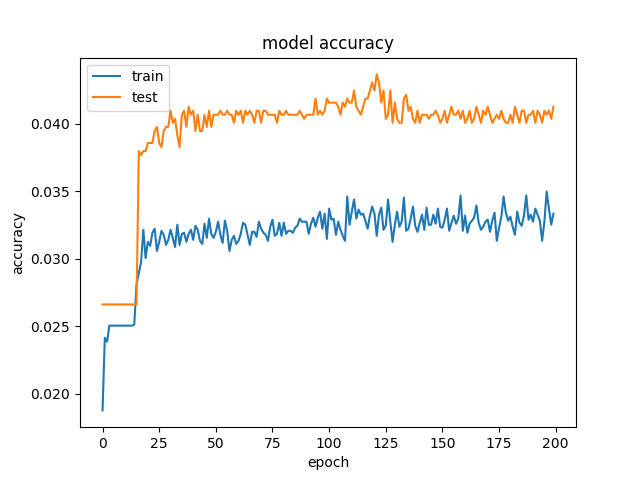

# Projekt: intersys_keras
Abschlussprojekt Interactive Systems SS2017

## Image Classification
##### Die Idee
Image Classification mit Hilfe eines zuvor trainierten neuronalen Netzes zur Vereinfachung und Reduzierung von Benutzerinteraktionen bei der Eingabe von Daten in ein Webformular.
Als Besonderheit sollten ORB ([Oriented FAST and rotated BRIEF](http://docs.opencv.org/3.0-beta/doc/py_tutorials/py_feature2d/py_orb/py_orb.html))
Feature Vektoren als Eingabeparameter dienen, um folgende Vorteile zu erlangen:
- Unabhängigkeit von Bildauflösungen
- ressourcenschondender als [CNNs](https://de.wikipedia.org/wiki/Convolutional_Neural_Network)
- ggf. bessere Ergebnisse als [SVMs](https://de.wikipedia.org/wiki/Support_Vector_Machine)

##### Umsetzung
Die Umsetzung erfolgte in einem kleinen Python Skript unter Verwendung von [Keras.io](https://keras.io/) und [OpenCV](http://opencv.org/).
Fürs Training wurde der [Caltech 257](http://www.vision.caltech.edu/Image_Datasets/Caltech256/) Bilderdatensatz eingesetzt.

Source Code: [keras_caltech256.py](https://github.com/GeParkinson/intersys_keras/blob/master/keras_caltech256.py)

### Ergebnisse - Loss, Accuracy

Die Kurven der beiden Metriken Loss und Accuracy zeigen einen typischen Verlauf beim maschinellen Lernen. Aufgrund dessen kann man schlussfolgern, dass die technische Umsetzung soweit korrekt erfolgt ist.
Die bei den Tests erreichte Genauigkeit (korrekte Zuordnung der Testbilder) von ca. 5% blieb allerdings weit hinter den Erwartungen zurück. Einen praktischen Nutzen erreicht die Software damit nicht.